# pg4

**Lead discovery and enrichment engine for Italian SMBs. It prefers free sources, puts a hard ceiling on every euro spent, and is heavily tested.**

[](https://github.com/MiloMilo2121/pg4/actions/workflows/ci.yml)


[](LICENSE)

Give pg4 a business category and a territory (*"real-estate agencies in the province of Padua"*). It scrapes every matching company from PagineGialle and Google Maps, then works out each company's **official website**, backed by evidence. From that site and from official registries it fills in email, PEC, phone, VAT number, revenue, headcount and social profiles. Every field records its source, every row records a status and a reason, and every euro spent is logged in a ledger.


<sub>The *Setaccio* dashboard (Next.js, Italian UI), running on the synthetic demo dataset (`pnpm demo`): 480 fictional B2B SaaS and deeptech companies in the northern Italian tech hubs. Cockpit, companies, enrichment and the coverage map (nation, Veneto, province of Padova) read live from the local API; some panels (market trends, credits, provider table) still show the design prototype's illustrative figures and are labelled *dati di esempio*. Built on the author's design system ("Grafite", app variant): graphite on paper, square panels, Archivo + DM Mono, one line-icon set.</sub>

---

## What it does

| Stage | How |
|---|---|
| **Discover** | Playwright drives PagineGialle and Google Maps page by page. The parsers are pure functions over saved HTML. Runs are checkpointed and resumable per `(provider, category, comune, page)`. Results are de-duplicated across comuni by `pg_url`, `maps_url`, phone and host. |
| **Verify the website** | A ladder of stages: the input website, then the PG detail page, then domain guessing (NER + DNS), then SERP, then RDAP rescue. A candidate site is accepted only when the page itself proves it belongs to the company: a matching VAT or phone number, or semantic evidence that clears strict gates. |
| **Enrich** | Extracts email, PEC, phone, socials and VAT from the site and its contact pages. Official data comes from VIES, business-register sources and public financial summaries (revenue, employees). Candidate emails are inferred and checked with MX/SMTP. |
| **Judge** | An optional two-axis judgment layer: **A** is business potential, **B** is the quality of the company's digital presence. High A with low B marks a "silent gem": a strong company that is under-represented online. |
| **Operate** | A CLI, a local dashboard, an MCP server so AI agents can drive the pipeline, a watchdog for overnight campaigns, and a recovery loop that opens fix PRs when a scraper breaks. |

## Engineering highlights

- **Money cannot leak.** All paid calls go through one `ProviderRouter`.
  - Paid providers are denied by default. They need a feature flag, an API key **and** an explicit `--enable-paid`.
  - Before every paid attempt, the router checks a per-lead cap re-read live from the `CostLedger`, plus an atomic run-level reservation.
  - A failed call is recorded at its real cost (for example, an Apify run that was started and billed), never silently as €0.
  - Incident that shaped this: a €0.10 run cap once reached €0.229 before anyone noticed. Tests now lock that entire class of bug.
- **Precision before recall.** A website is never "found" because a search engine ranked it first.
  - Directory portals, franchise flagships, parked domains and WhatsApp/click-to-call links are filtered out, following a taxonomy of every false positive pg3 produced ([`docs/legacy_failure_taxonomy.md`](docs/legacy_failure_taxonomy.md)).
  - The paid-SERP pass was audited at **96.2% precision** on the websites it added.
- **Nothing is dropped silently.**
  - Every input row produces an output row with a `status` and a `reason_code`.
  - A checkpoint that says "done" while its JSONL is missing is a hard stop.
  - Only an explicit completion manifest lets a campaign cell count as finished.
- **Built to survive a laptop.** On the first real campaigns, 99% of scraper failures were network drops, not anti-bot blocks. The answers are:
  - retry with backoff, circuit breakers and per-provider rate limits;
  - a PID-reuse-safe watchdog that relaunches dead campaigns;
  - a recovery agent that turns a broken cell into a pull request, with the merge to `main` held behind a protected environment.
- **Safe on untrusted input.** URLs and mail hosts come from scraped data, so every fetch and SMTP dial is checked at connect time and can never reach `localhost`, private networks or the cloud-metadata endpoint, redirects included. Bodies are size-capped.
- **Safe to hand to an agent.** The MCP server sandboxes every path an agent sends. Outputs must stay under `output/`, and traversal, symlink escapes and dotfiles are rejected.
- **Strict gates.**
  - TypeScript `strict`, with `noUnusedLocals`/`noUnusedParameters` on.
  - Zero `any`.
  - Type-aware lint for floating and misused promises.
  - 1.2k+ offline unit tests.
  - A production dependency audit in CI for both the engine and the dashboard.
- **A dashboard you can drive from the keyboard.** ⌘K finds any view, action, market or company (name, city or VAT); `g` + a letter jumps between views; `/` searches the archive. Overlays are real dialogs (focus trap, Escape, focus return), the map is operable without a mouse, and a Playwright + axe suite checks every view and overlay at 1440px and 360px.

## Architecture

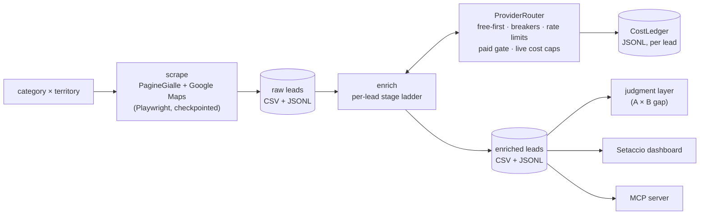

```text
src/
  cli/          thin entry points: scrape, enrich, run, judge, lookup, coverage, benchmark
  discovery/    pure PG/Maps parsers, live navigators, dedupe, website evidence gates
  enrichment/   stage ladder, field cascades, extraction, email inference, lead score
  providers/    router + adapters (SERP, HTTP, LLM, Apify, OpenAPI, email)
  runtime/      cost ledger, circuit breaker, rate limiter, checkpoint, locks, shutdown
  judgment/     two-axis judgment layer (collectors, judges, critic, config)
  compliance/   GDPR suppression list
  server/       local dashboard API + MCP stdio server
  types/        the one canonical Lead type and output schemas (append-only)
web/            Setaccio dashboard (Next.js 16, own lockfile and CI gate)
tools/          operator passes and research probes (typechecked, not shipped)
```

More in [`docs/architecture.md`](docs/architecture.md) (invariants and command flow) and [`docs/provider_cascade_architecture.md`](docs/provider_cascade_architecture.md).

## How it decides

Every diamond below is a decision the code actually takes, traced from the source. Colours: **green** verified / target, **red** dropped / blocked, **amber** partial / borderline, **purple** cost, privacy and safety gates.

- [Overview](#overview)
- [Discovery](#discovery)
- [Enrichment](#enrichment)
- [Is this website really the company's?](#is-this-website-really-the-companys)
- [Judgment](#judgment)
- [Operations](#operations)
- [Known gaps](#known-gaps)

### Overview

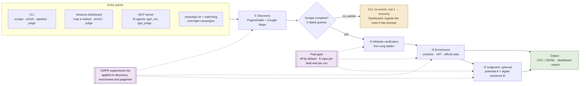

The dashboard runs the same `pipeline` command as the CLI, one process per category × province, always on free sources only. Depth **Rapido** scrapes the province capital, one page (30–120 s); **Completo** and **Esteso** run the whole province. While a run is going, its rows are ingested every 2 seconds, so the dashboard counts grow live.

### Discovery

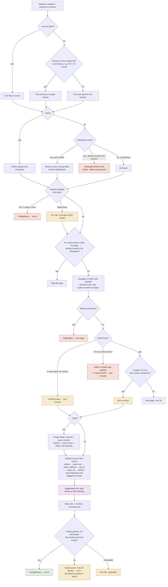

Nothing is dropped for relevance at this stage: Maps tags `category_match` and `permanently_closed`, and closed businesses are skipped at enrichment.

### Enrichment

```mermaid
flowchart TD
  R0["Run setup"] --> PG{"--enable-paid<br/>or PAID_DEFAULT_ON?"}
  PG -- "no" --> FREE["Free sources only · €0"]
  PG -- "yes" --> SEC{"At least one paid provider<br/>enabled and keyed?"}
  SEC -- "no" --> SE["Explicit flag: error<br/>default: warning and a free run"]
  SEC -- "yes" --> CE["Caps: per lead, default €0.10 · per run<br/>cap 0 = paid off"]
  FREE --> L0
  CE --> L0
  L0["Each row, 4 in parallel"] --> S1{"On the suppression list?"}
  S1 -- "yes" --> X1["Dropped, no row written"]
  S1 -- "no" --> S2{"Permanently closed?"}
  S2 -- "yes, without --include-closed" --> X2["SKIPPED"]
  S2 -- "no" --> S3{"Input quality under 0.3?"}
  S3 -- "yes" --> X3["SKIPPED · input quality too low"]
  S3 -- "no" --> W1
  W1["Rung 1: website given in the input<br/>drops messaging links, redirects, directories, socials"] -- "verified" --> V
  W1 -- "no" --> W2["Rung 2: PagineGialle detail page<br/>fills VAT, phone, email, address<br/>accepts the site only on a VAT or phone match"]
  W2 -- "verified" --> V
  W2 -- "no" --> W3["Rung 3: guess the domain<br/>up to 60 domains → DNS → best 6"]
  W3 -- "verified" --> V
  W3 -- "no" --> W4["Rung 4: free web search<br/>DuckDuckGo → Bing · verify the top 5"]
  W4 -- "verified" --> V
  W4 -- "no" --> W4P{"Paid on and a distinctive name?"}
  W4P -- "yes" --> W4B["Serper → Tavily → Exa<br/>VAT or phone match only<br/>vetoed if it looks like an aggregator"]
  W4P -- "no" --> W5
  W4B -- "verified" --> V
  W4B -- "no" --> W5["Rung 5: RDAP, the .it registry<br/>VAT in the record → 0.9 · name → match"]
  W5 -- "verified" --> V
  W5 -- "no" --> NS["No website"]
  V["Verified website"] --> FG
  NS --> FG
  FG["Free extraction from the site:<br/>same-domain email · PEC · socials · VAT · phone<br/>fills empty fields only"] --> DP{"Deep pages enabled?"}
  DP -- "yes" --> DPX["Up to 3 contact / about pages"]
  DP -- "no" --> OD
  DPX --> OD
  OD{"Official data enabled?"}
  OD -- "yes" --> VI["VIES on up to 3 VAT numbers<br/>2 name tokens in common → 0.95"]
  VI --> FI["Revenue and employees<br/>different legal entity → dropped, fail-closed"]
  OD -- "no" --> EM
  FI --> EM
  EM{"Email inference enabled<br/>and no email yet?"}
  EM -- "yes" --> EMX["Pattern + MX/SMTP check<br/>fills only when 'deliverable'"]
  EM -- "no" --> PL
  EMX --> PL
  PL{"Paid on and budget left?"}
  PL -- "yes" --> AP["Last resort: Apify Maps → Perplexity<br/>→ Apify financials / registry"]
  PL -- "no" --> FN
  AP --> FN
  FN["Finish: second suppression pass<br/>status FOUND_WEBSITE_ONLY or NOT_FOUND · lead_score<br/>every call recorded in the cost ledger"]
  classDef ok fill:#e2eedf,stroke:#4f7a4a,color:#1f3a1c
  classDef ko fill:#f5e0da,stroke:#a4493a,color:#4a1a12
  classDef warn fill:#f6ead0,stroke:#b07d2a,color:#4a3510
  classDef gate fill:#efe4f3,stroke:#7a4f8f,color:#2e1a38
  class V ok
  class X1,X2,X3,SE ko
  class NS warn
  class FREE,CE,W4B,AP gate
```

Each rung has a deadline (12 s; 90 s for Apify and Perplexity). Past a spending cap, the paid call is skipped and the lead continues on free sources; a circuit breaker isolates a provider after 5 failures in 60 s.

### Is this website really the company's?

The core of precision: a site is attributed to a company only when the page itself proves it.

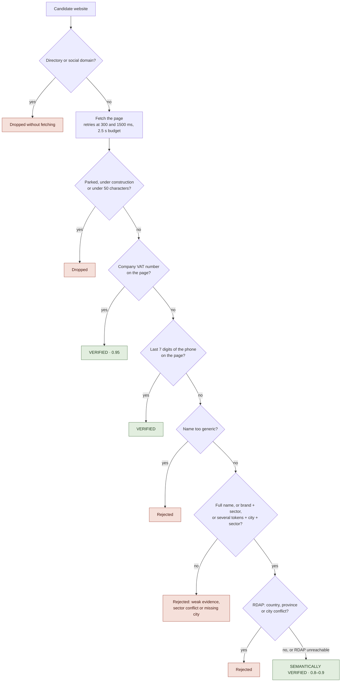

### Judgment

Two independent axes: **A** is business potential, from third-party sources only; **B** is the quality of the digital presence, from owned channels only. High A with low B is a **silent gem**: a strong company that is under-represented online.

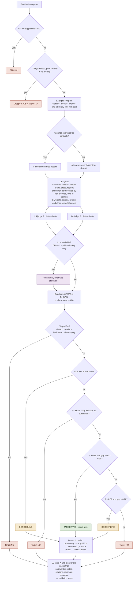

From the dashboard, judgment always runs without an LLM and at €0. Without a paid source for axis A, many companies stay BORDERLINE by design: the firewall never scores what was not measured.

### Operations

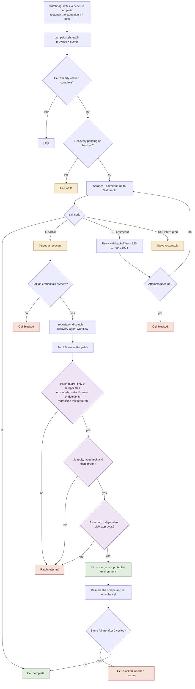

### Known gaps

Found while mapping the code above; none affects the free default path.

- **Esteso = Completo**: the dashboard's "Esteso" depth does nothing beyond "Completo" yet.
- **Guessed domains**: a site found by domain guessing (or verified only semantically) does not hand its page body to contact extraction, which then happens only with deep pages enabled (`hyper_guesser_stage.ts:66-77`).
- **Input VAT**: promoted to `vat_code_final` before VIES runs, so the VIES check of a declared VAT is effectively skipped (`field_registry.ts:215`).
- **Apify Maps / Registro / Bilanci** accept the data when the source returns no name: the opposite of `isWrongEntity`'s fail-closed rule.
- **RDAP rescue** can accept a site that rung 1 had already rejected.
- **Unused statuses**: `FOUND_COMPLETE` and `ENRICHMENT_ONLY_NO_WEBSITE` exist in the type, but no path assigns them.
- **Triage**: 5 disqualifiers are marked as cheaply checkable, 3 are checked (`judgment/config/v0.ts:294-298`).
- **Recorded model**: with `--paid` the verdict records the configured model, but the router may be answered by another provider (`runtime_context.ts:58`).

| Area | Main files |
|---|---|
| Orchestration | `src/cli/run.ts` (gate on a partial scrape: 123–135) |
| Discovery | `src/discovery/scrape_pipeline.ts`, `sources/pagine_gialle_live.ts`, `sources/maps_live.ts`, `preflight.ts`, `deduper.ts`, `discovery/scrape_completion.ts` (completion criteria: 250–256) |
| Enrichment | `src/cli/enrich_command.ts`, `enrichment/enrichment_pipeline.ts`, `stages/*_stage.ts`, `website/verify_candidates.ts`, `discovery/website/preverify_gate.ts` |
| Paid gate | `providers/provider_router.ts` (filters: 399–448, budget reservation: 324–360), `providers/smart_serper_gate.ts`, `providers/paid_evidence_gate.ts` |
| Judgment | `src/judgment/run_judgment.ts`, `triage.ts`, `collectors/collect_a.ts`, `judges/gap_reasoner.ts` (target rule: 68–78), `judges/critic.ts` |
| Operations | `scripts/campaign.sh`, `scripts/recovery_coordinator.sh`, `src/cli/recovery_agent.ts`, `src/runtime/recovery_patch_guard.ts` |
| Dashboard | `src/server/api_server.ts`, `src/server/scrape_job.ts`, `src/server/scrape_request.ts` |

## Quick start

Requires Node 24 and pnpm.

```bash
git clone https://github.com/MiloMilo2121/pg4.git && cd pg4
pnpm install && pnpm --dir web install
cp .env.example .env
```

**1. Enrich offline.** No keys, no network, no browser:

```bash
pnpm enrich --input examples/input_companies.csv \
  --out output/examples/enriched.csv \
  --mock-http examples/mock_http_pages.json
# → [enrich] done  total=5 with_website=5 errors=0 · cost €0
```

**2. Open the dashboard on synthetic data:**

```bash
pnpm demo        # API on :8787 + dashboard on :3000, 480 fictional B2B SaaS / deeptech companies
pnpm demo:live   # same, but empty: "Mappa il mercato" → depth "Rapido" scrapes a real
                 # capital in ~1 min, free sources only, and the counts grow live
```

In the dashboard: <kbd>⌘</kbd> <kbd>K</kbd> (or <kbd>Ctrl</kbd> <kbd>K</kbd>) opens the command palette, <kbd>?</kbd> lists every shortcut, and the status bar at the bottom shows the engine, the measured API latency, the running job and the session cost.

**3. Scrape for real** (Playwright Chromium, live pages):

```bash
pnpm scrape --category "agenzie immobiliari" --province BL --out output/raw.csv
pnpm enrich --input output/raw.csv --out output/enriched.csv          # free-only by default
pnpm run pipeline --category "agenzie immobiliari" --province BL --out output/campaign
```

| Command | What it does |
|---|---|
| `pnpm scrape` | Discovery from PG/Maps (live or `--fixture` HTML), resumable |
| `pnpm enrich` | Website verification + enrichment; `--enable-paid --run-cost-ceiling-eur <€>` to allow paid providers |
| `pnpm run pipeline` | Scrape → enrich under one run id; refuses to enrich an incomplete scrape |
| `pnpm judge` | Two-axis judgment over an enriched CSV |
| `pnpm lookup` | Find a lead already in `output/` by VAT or phone |
| `pnpm coverage` | Coverage gap map: industry × territory against ISTAT counts |
| `pnpm mcp` | MCP stdio server exposing the pipeline to agents |

Every command accepts `--help`.

<details>
<summary>More screenshots</summary>


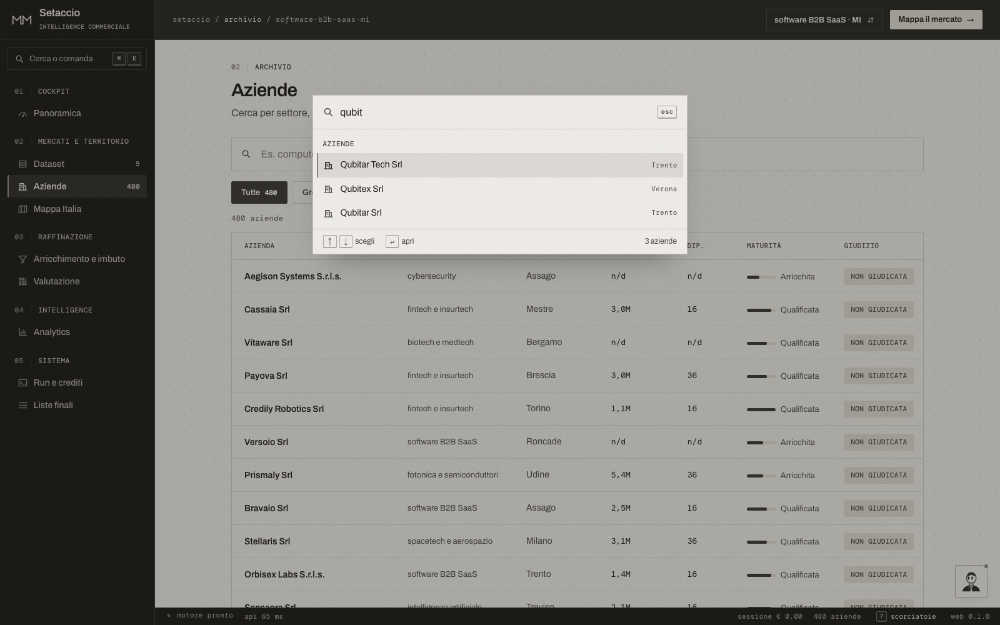

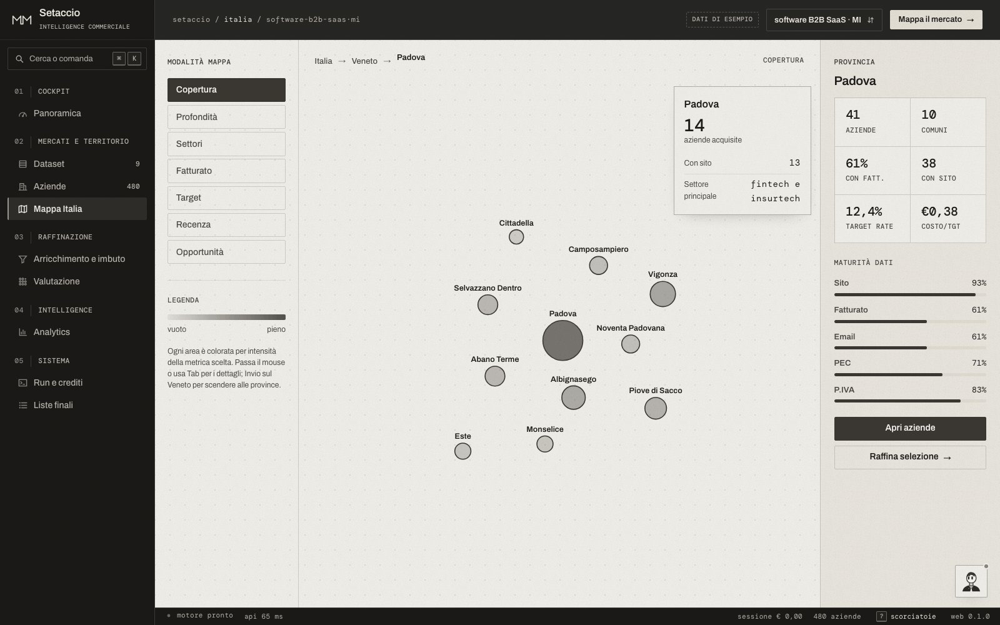
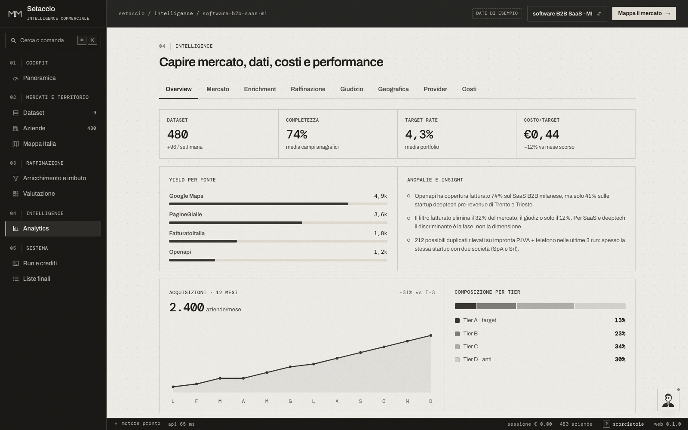
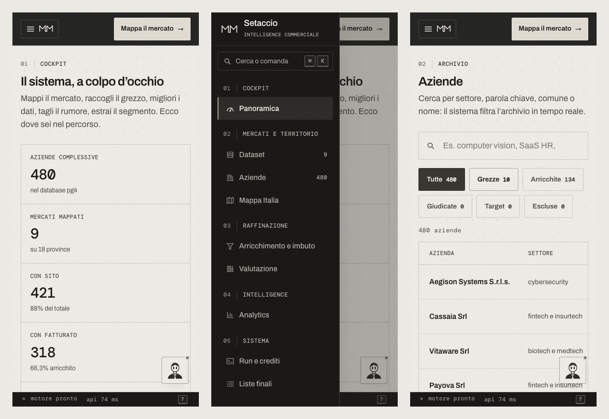

</details>

## Quality gates

```bash
pnpm typecheck && pnpm lint && pnpm test && pnpm build
RUN_SMOKE=1 pnpm test:smoke    # opt-in: touches real network/browser
pnpm --dir web test:e2e        # dashboard: axe, keyboard paths, 1440px and 360px (local, starts pnpm demo)
```

CI runs two independent jobs on every PR:
- **core**: frozen install, typecheck, unit tests, lint, build and production dependency audit;
- **dashboard**: typecheck, lint (including design-system rules: no literal colours, radii or shadows, no em dash, no italics), `next build` and audit.

## Why pg4 exists

pg4 is the third generation of the same project, and the earlier ones are the reason it looks the way it does.

- **pg1** was the first resolver. It is kept only as a reference for the lessons it taught.
- **pg3** became the production runtime and then collapsed under its own operational weight. It had BullMQ/Redis, crawler sidecars, monolithic orchestration and cost controls nobody could reason about as a single system. Its logs show the symptoms: Redis degradation, sidecar crashes, crt.sh 5xx storms, empty search results counted as provider failures, and paid providers left to burn money until someone killed the process.
- **pg4** started as a clean export and a deliberately small core. Every failure mode pg3 had was audited from its real outputs and turned into an explicit guardrail with a test. Examples: the same agency emitted 10 times across comuni, and 191 "websites" that were really immobiliare.it listings. The result is a short list of invariants and one boundary per concern. Adding a provider is one file; adding a stage is one file.

## Responsible use

This is a portfolio project. It collects **publicly listed business information**; that data is personal data under the GDPR only when it identifies a natural person (for example, a sole trader).

- The repository contains **no scraped data**. Test fixtures are anonymised and the demo dataset is fictional (`*.example` domains, `999…` VAT numbers). It is generated by `scripts/generate_demo_dataset.ts`; the screenshots above by `pnpm --dir web exec node scripts/capture-screenshots.mjs` against a running `pnpm demo`.
- Scraping third-party sites may conflict with their terms of service. Check the terms and your legal basis before running live scrapes.
- There is a GDPR toolkit in [`docs/gdpr/`](docs/gdpr/): a legitimate-interest assessment template, an Art. 14 notice and a pre-production checklist. A suppression list is enforced by the pipeline.
- Paid providers are off unless you explicitly turn them on.

## License

[MIT](LICENSE) © Marco Milanello
